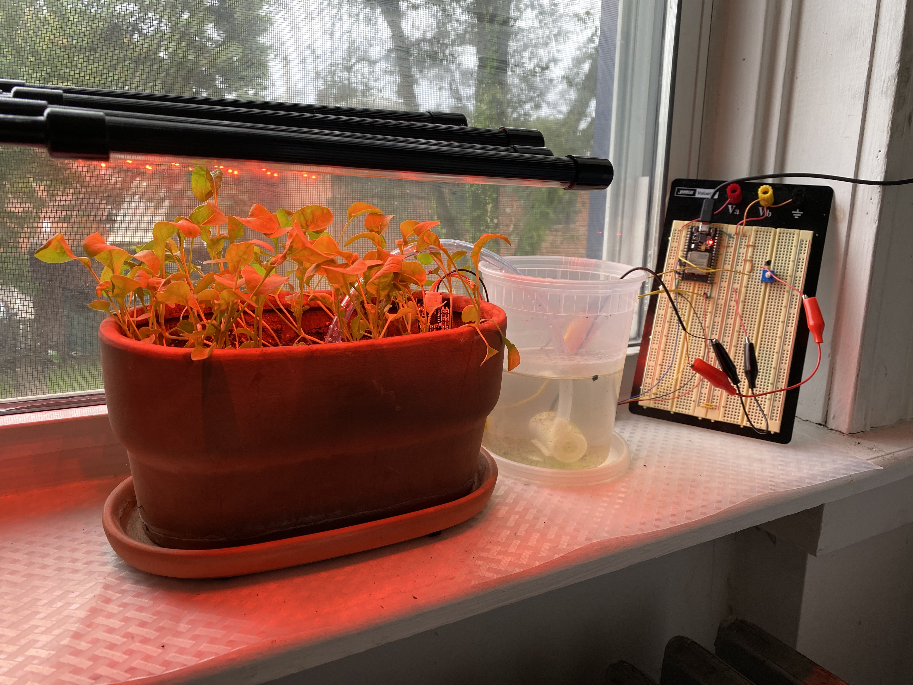
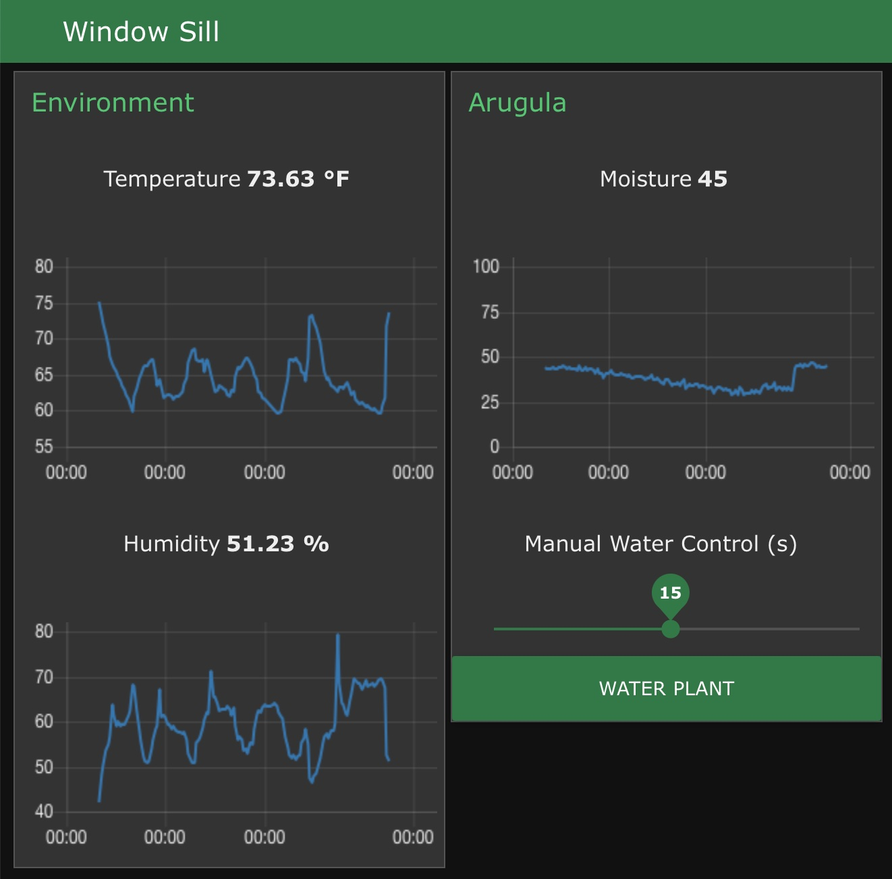

# DIY Automated Plant Irrigator - ESP32
This repository is for the automated watering of a single plant using an ESP32 communicating with a Raspberry Pi over MQTT. The system can be controlled and monitorred using a web interface using Node-RED.

## Images

### Physical Setup
The ESP32 (at the top left of the breadboard) is connected to power via USB, a moisture sensor (the right side of the pot behind the plants), and a transistor that controls the pump. The pump is in the takeout container filled with water connected to the pot via a 1/4" PVC tube with holes drilled on the end (visible in the center of the pot behind the plants) for water to reach the soil. The pot also has a separate grow light on a timer in order to supplement the light from the window.

<p align="center">

<!--  -->
</p>

### User Interface
The user interface consists of an environment tab and a plant tab. The environment tab shows the current temperature and humidity along with a plot of their values for the past seven days. The plant tab shows the current moisture reading along with a plot of its value for the past seven days. The plant tab also has a manual water control which allows the user to move the slider to change the duration the pump runs, then hit "WATER PLANT" to send the command.

<p align="center">
<
<!--  -->
</p>

## Bill of Materials

<center>

| Part  | Item Number | Quantity |
| ------------- | ------------- | ------------- |
| Raspberry Pi 3 Model B | N/A | 1 |
| HiLetgo ESP32 | ESP-WROOM-32 | 1 |
| Temperature and Humidity Sensor | AHT20 | 1 |
| Capacitive Moisture Sensor | N/A | 1 |
| 5V Micro Submersible Mini Pump | N/A | 1 |
| 1/4" PVC Tubing | N/A | 1 |

</center>

## Message Format
In order to communicate to Node-RED using MQTT, the messages have to be formatted as shown below.
```
{
  "_msgid": 1,
  "temperature": 75,
  "humidity": 51
}
```

## Next Steps
- Document electronics

## Resources
- [ESP32 MQTT – Publish and Subscribe with Arduino IDE](https://randomnerdtutorials.com/esp32-mqtt-publish-subscribe-arduino-ide/)
